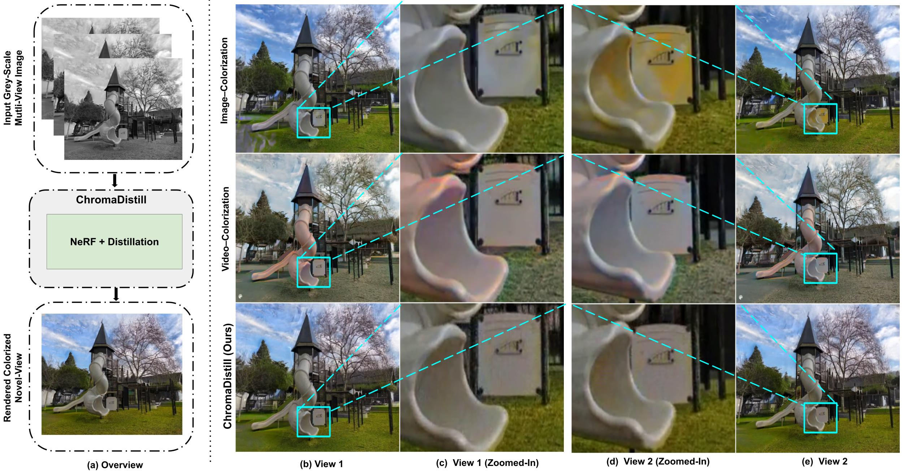

<div align="center">

<h1>ChromaDistill : Colorizing Monochrome Radiance Fields with Knowledge
Distillation</h1>
<h1>Accepted at WACV 2025</h1>

<p align="center">
    <a href="https://www.linkedin.com/in/ankit-dhiman-46109a174/" target="_blank"><strong>Ankit Dhiman</strong></a> <sup>1,2<b></b></sup>
    ·
    <a href="https://rsrinath14.github.io/" target="_blank"><strong>R Srinath</strong></a> <sup>1<b></b></sup>
    ·
    <a href="https://www.linkedin.com/in/srinjay-sarkar-1501b9112/" target="_blank"><strong>Srinjay Sarkar</strong></a> <sup>1</sup>
    ·
    <a href="https://in.linkedin.com/in/lokesh-boregowda-14321810" target="_blank"><strong>Lokesh R Boregowda</strong></a> <sup>3</sup>
    ·
    <a href="https://cds.iisc.ac.in/faculty/venky/" target="_blank"><strong>R Venkatesh Babu</strong></a> <sup>1</sup>
</p>
<p align="center" style="padding-top: 0px;">
    <br>
    <sup>1</sup> Vision and AI Lab, IISc Bangalore
    <br>
    <sup>2</sup> Samsung R & D Institute India - Bangalore
    <br>
</p>

<a href="https://arxiv.org/abs/2309.07668">
</a>
<a href="https://val.cds.iisc.ac.in/chroma-distill.github.io/">
</a>
<br>


</div>

## 🗓️ TODO
- [ ] Release the training, inference and evaluation codes
- [ ] Release the checkpoints

## 📖 Abstract

Neural radiance field (NeRF) and Gaussian-Splatting based methods enable high-quality novel-view synthesis for multi-view images. The question arises: Can these representations generate colorized novel views when provided with monochromatic(grey-scale) inputs? Beyond its visual aesthetic significance in portraying worlds, color plays a pivotal role in downstream applications such as open-set scene decomposition. This research presents a method for synthesizing colorized novel views from input grey-scale multi-view images. Applying image or video-based colorization techniques to generated grey-scale novel views demonstrates artifacts arising from inconsistencies across views. Even training a radiance field network on colorized grey-scale image sequences fails to resolve the 3D consistency issue. We propose a distillation-based approach, leveraging knowledge from colorization networks trained on natural images and transferring it to the chosen 3D representation. Specifically, our method uses the radiance field network as a 3D representation and transfers knowledge from existing 2D colorization methods. This strategy introduces no additional weights or computational overhead to the original representation during inference. The experimental results demonstrate the superiority of our proposed method in generating high-quality colorized novel views for indoor and outdoor scenes, showcasing notable advantages in cross-view consistency compared to baseline approaches. Additionally, we illustrate the seamless extension of our method to a Gaussian-Splatting representation.

## 🤝🏼 Cite Us

```
@misc{dhiman2023corfcolorizingradiance,
      title={CoRF : Colorizing Radiance Fields using Knowledge Distillation}, 
      author={Ankit Dhiman and R Srinath and Srinjay Sarkar and Lokesh R Boregowda and R Venkatesh Babu},
      year={2023},
      eprint={2309.07668},
      archivePrefix={arXiv},
      primaryClass={cs.CV},
      url={https://arxiv.org/abs/2309.07668}, 
}
```